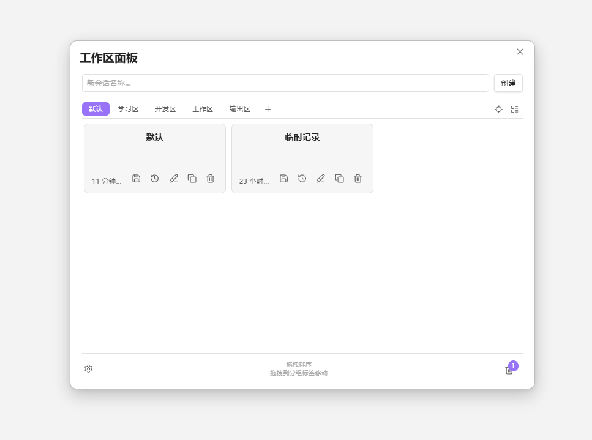
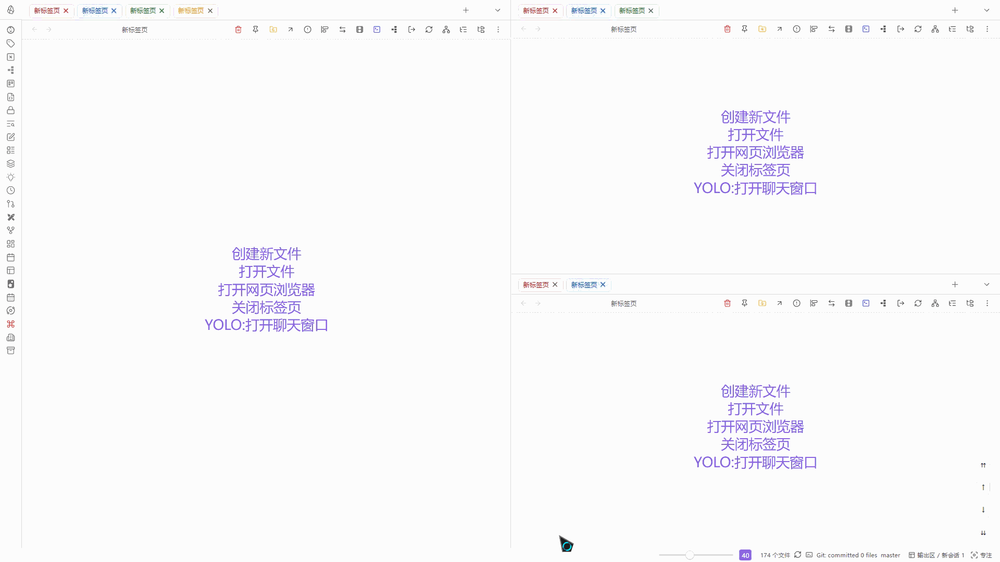

# Workspace++ Beta

Workspace++ Beta 是 [Workspace++](https://github.com/s1m4ne/obsidian-workspace-plus) 的功能修改版，用于保存、切换与组织 Obsidian 工作区会话。工作区管理能力可追溯至 [Workspaces Plus](https://github.com/jsmorabito/obsidian-workspaces-plus)。

本分支在上游基础上增加了卡片化管理面板、回收站归档、版本历史（含手动快照）、会话恢复（侧边栏 / 文件名 / UID）、任务视图与专注模式等能力。相比原版，本版本将核心操作集中到工作区面板上——无需复杂命令，直接在面板中即可完成工作区的创建、切换与管理。

## 插件介绍

### 工作区管理面板

- 可以对工作区进行创建、注释、切换、删除、备份、复制
- 支持分组管理工作区，可自定义创建分组，对工作区进行分类、批量操作与切换分组视图
- 支持对两侧侧边栏是否随会话恢复进行控制，方便在切换工作区时只恢复主编辑区、保留当前左右侧边栏
- 支持版本历史回溯；切换时可自动保存，也可手动保存命名快照
- 支持回收站：删除的工作区可归档，之后在回收站中恢复或永久删除
- 恢复会话时，可按文件名匹配缺失路径，也可通过笔记属性UID标识识别
- 底部状态栏显示当前分组与工作区（可开关），单击即可打开工作区管理面板

### 任务视图模式

通过命令「切换标签页（任务视图）」打开类 Mission Control 的网格预览：

- 点击预览卡片即可切换到对应标签页；点击蒙版或空白处关闭任务视图
- 拖动卡片头部可在当前分栏内排序；拖到其他分栏区域可跨分栏移动标签
- 顶部页码可切换根分栏预览；在任务视图内任意位置滚动鼠标滚轮，也可快速切换分栏（仅切换预览，不改变后台焦点）
- 数字键 `1`–`9` 可跳转到对应分栏；双击分栏页码可进入该分栏的专注模式
- 可在设置中调整缩略图比例、内容缩放，以及是否显示悬停操作提示

### 专注模式

专注模式可配合工作区与任务视图使用：

- 底部状态栏可显示是否处于专注模式
- 每个工作区的专注状态单独保存，互不影响
- 专注模式下可隐藏非活动标签
- 任务视图下可直接切换分栏视图，或双击页码进入对应分栏专注

## 设置概览

| 分类 | 主要内容 |
| --- | --- |
| 常规 | 语言、快捷键入口、恢复侧边栏、状态栏控件、任务视图预览、专注模式隐藏非活动标签 |
| 会话 | 会话恢复（按文件名 / UID）、自动保存模式、筛选与删除确认、版本历史、轮转备份 |
| 分组 | 启用分组、创建 / 管理分组 |
| 高级 | 会话存储位置、重置与清理等 |

## 安装

### 使用 BRAT

1. 安装 [BRAT](https://github.com/TfTHacker/obsidian42-brat)
2. 打开 **设置** > **BRAT** > **Add Beta plugin** 
3. 粘贴本仓库地址并添加

### 从 Release 安装

1. 从本仓库最新 Release 下载 `main.js`、`manifest.json`、`styles.css`
2. 在库中创建目录：`<你的库>/.obsidian/plugins/workspace-plus-plus-beta/`（或与本地插件文件夹名一致）
3. 将上述三个文件放入该目录
4. 打开 **设置** > **社区插件**，启用 **Workspace++ Beta**

## 命令

可在 **设置** > **快捷键** 中为下列命令绑定自定义快捷键。

| 命令 | 推荐快捷键 |
| --- | --- |
| 管理会话 | Alt + 1 |
| 切换标签页（任务视图） | Alt + 2 |
| 切换专注标签模式 | F4 |
| 保存当前会话 | - |
| 切换会话切换时自动保存 | - |
| 启用会话切换时自动保存 | - |
| 禁用会话切换时自动保存 | - |
| 查看会话版本历史 | - |

## 致谢

欢迎在本仓库提交问题、功能建议与 PR。

上游项目：

- [Workspace++](https://github.com/s1m4ne/obsidian-workspace-plus) by s1m4ne
- [Workspaces Plus](https://github.com/jsmorabito/obsidian-workspaces-plus) by Johnny / Nothingislost

## 许可

MIT
